---

layout: page

show\_meta: false

title: "Publication"

subheadline: ""

teaser: 

header:

   image\_fullwidth: 

permalink: "/publication/"

---

[[sort by type][1]]	[[sort by date][2]]

# Journal Publications

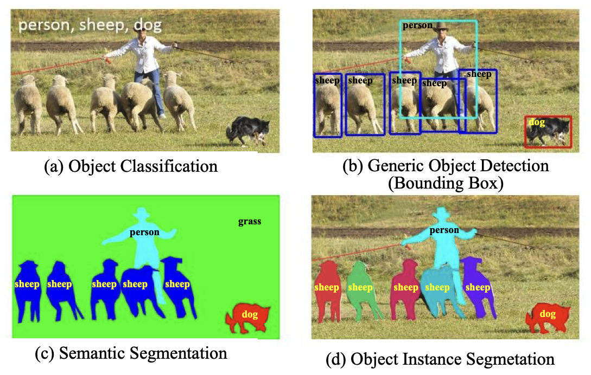

Liu, Li, **Wanli Ouyang**, Xiaogang Wang, Paul Fieguth, Jie Chen, Xinwang Liu, and Matti Pietikinen, ”Deep learning for generic object detection: A survey,” International Journal of Computer Vision (IJCV), accepted, Sept. 2019.

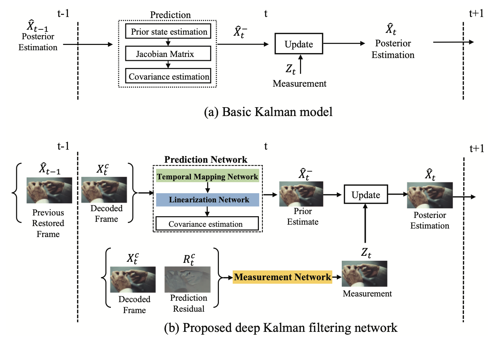

Guo Lu, Xiaoyun Zhang, **Wanli Ouyang**, Dong Xu, Li Chen, and Zhiyong Gao, “Deep Non-local Kalman Network for Video Compression Artifact Reduction”, Trans. Image Process. (TIP), accepted Sept., 2019.

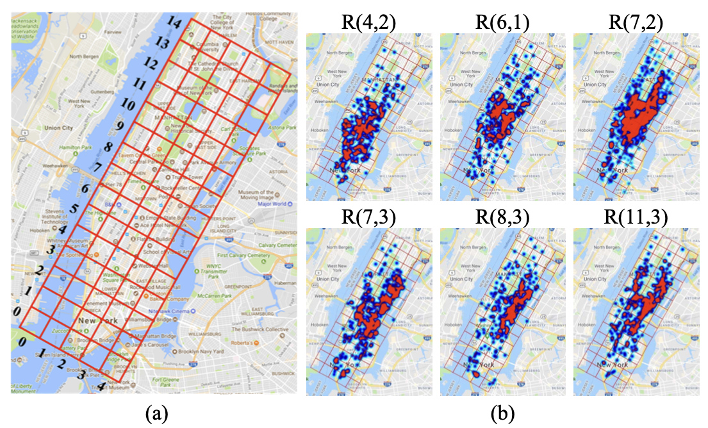

Lingbo Liu, Zhilin Qiu, Guanbin Li, Qing Wang, **Wanli Ouyang**, Liang Lin, “Contextualized Spatial-Temporal Network for Taxi Origin-Destination Demand Prediction”, IEEE Transactions on Intelligent Transportation Systems (TITS), accepted Apr., 2019.

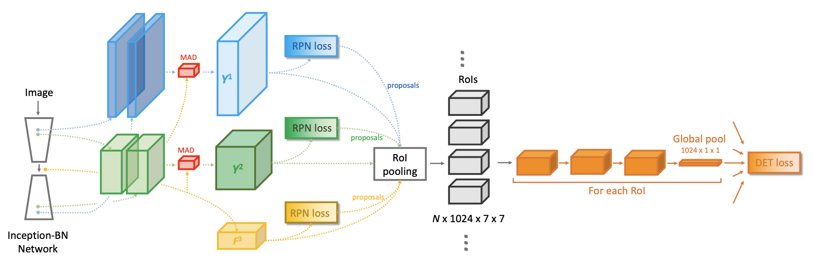

H. Li, Y. Liu, **W. Ouyang**, X. Wang, ”Zoom Out-and-In Network with Map Attention Decision for Region Proposal and Object Detection,” International Journal of Computer Vision (IJCV), Accepted Jun., 2018.

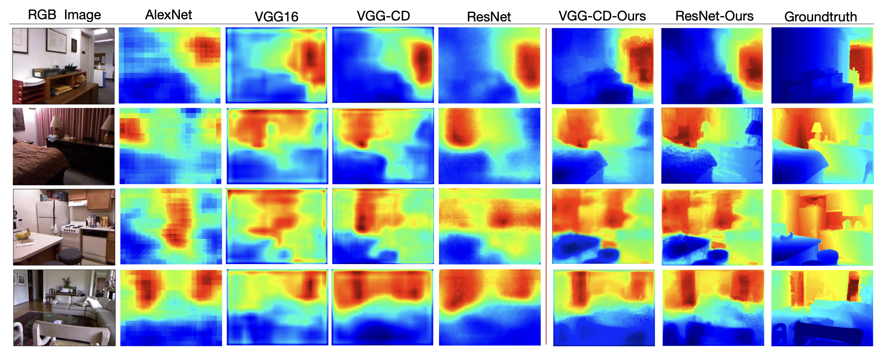

D. Xu, E. Ricci, **W. Ouyang**, X. Wang, N. Sebe, ”Monocular Depth Estimation using Multi-Scale Continuous CRFs as Sequential Deep Networks,” IEEE Trans. Pattern Anal. Mach. Intell. (PAMI), Accepted Apr., 2018.

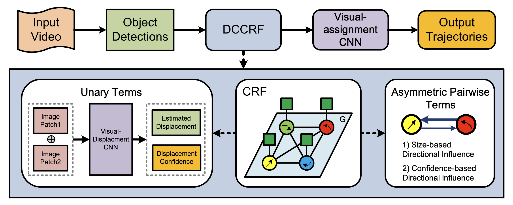

Hui Zhou, **W. Ouyang**, J. Cheng, X. Wang, H. Li, ”Deep Continuous Conditional Random Fields with Asymmetric Inter-object Constraints for Online Multi-object Tracking,” IEEE Trans. Circuits Syst. Video Technol. (CSVT), Accepted Apr., 2018.

**Wanli Ouyang**, H. Zhou, H. Li, et. al, ”Jointly learning deep features, deformable parts, occlusion and classification for pedestrian detection,” IEEE Trans. Pattern Anal. Mach. Intell. (PAMI), 40(8):1874-1887, Aug. 2018.

X. Zeng (equal contribution), **W. Ouyang** (equal contribution), et. al, ”Crafting GBD-Net for Object Detection,” IEEE Trans. Pattern Anal. Mach. Intell. (PAMI), 40(9): 2109-2123, Sep. 2018.

K. Kang, H. Li, J. Yan, X. Zeng, B. Yang, T. Xiao, C. Zhang, Z. Wang, R. Wang, X. Wang, **W. Ouyang**, T-CNN: Tubelets with Convolutional Neural Networks for Object Detection from Videos, IEEE Transactions on Circuits and Systems for Video Technology (CSVT), accepted, 2017.

**W. Ouyang**, T. Zhao, W. Cham, et. al. “Fast Full-Search Equivalent Pattern Matching Using Asymmetric Haar Wavelet Packets. , IEEE Trans. Circuits Syst. Video Technol. (CSVT), accepted, 2016.

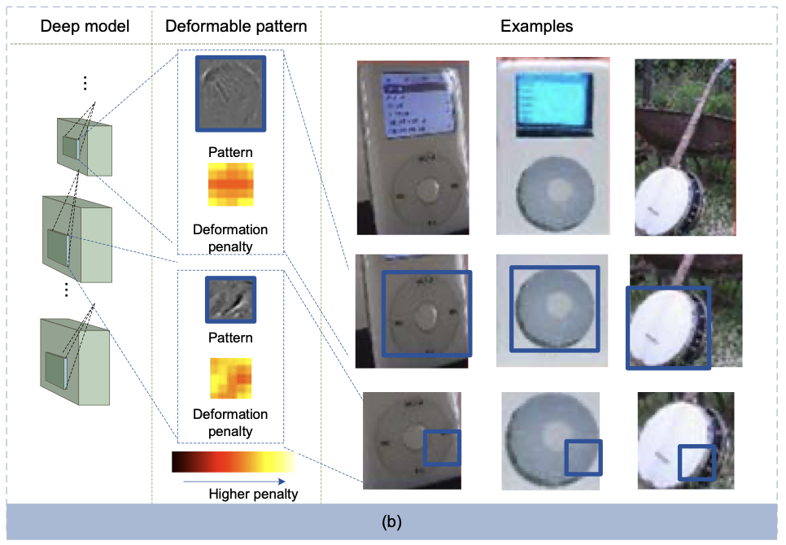

**W. Ouyang**, X. Wang, et. al. “DeepID-Net: Object Detection with Deformable Part Based Convolutional Neural Networks”, IEEE Trans. Pattern Anal. Mach. Intell. (PAMI), 39(7):1320-1334, Jul. 2017.

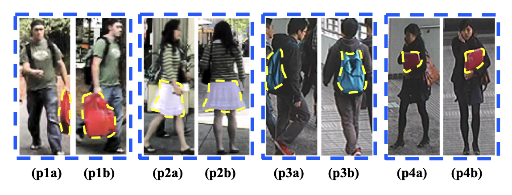

R. Zhao, **W. Ouyang** (Correspondence author), X. Wang, “Person Reidentification by Saliency Learning”, IEEE Trans. Pattern Anal. Mach. Intell. (PAMI), 39(2):356-70, Feb. 2017.

**W. Ouyang**, X. Zeng, X. Wang, “Learning Mutual Visibility Relationship for Pedestrian Detection with a Deep Model”, International Journal of Computer Vision (IJCV), 120(1):14-27, Oct. 2016.

**W. Ouyang**, X. Zeng, X. Wang, “Partial Occlusion Handling in Pedestrian Detection with a Deep Model”, IEEE Trans. Circuits Syst. Video Technol. (CSVT), 26(11):2123-37, Nov. 2016.

**W. Ouyang**, X. Zeng and X. Wang, “Single-Pedestrian Detection Aided by TwoPedestrian Detection”, IEEE Trans. Pattern Anal. Mach. Intell. (PAMI), 37(9):1875 - 1889, Sept. 2015.

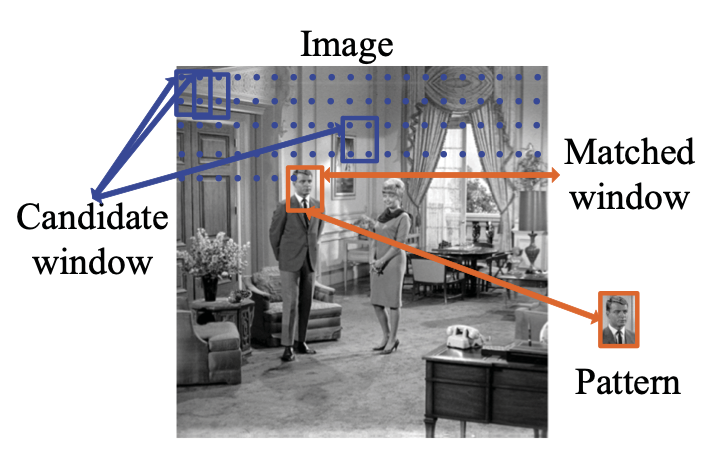

**W. Ouyang**, R. Zhang and W.-K. Cham, “Segmented Gray-Code Kernels for Fast Pattern Matching”, IEEE Trans. Image Process. (TIP) , 22(4):1512-1525, Apr. 2013.

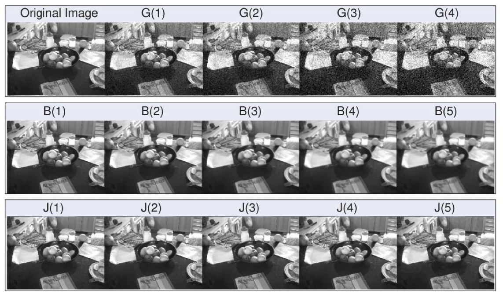

**W. Ouyang**, F. Tombari, S. Mattoccia, L. D. Stefano, and W.-K. Cham, “Performance Evaluation of Full Search Equivalent Pattern Matching Algorithms,” IEEE Trans. Pattern Anal. Mach. Intell. (PAMI), 34(1):127-143, Jan. 2012.

**W. Ouyang** and W.-K. Cham, “Fast algorithm for Walsh Hadamard transform on sliding windows”, IEEE Trans. Pattern Anal. Mach. Intell.(PAMI), 32(1):165-171, Jan. 2010.

Y. Li, N. Xiao, **W. Ouyang**, ”Improved Boundary Equilibrium Generative Adversarial Networks,” IEEE Access”, Accepted, Jan., 2018.

Y. Li, N. Xiao, **W. Ouyang**, ”Improved Generative Adversarial Networks with Reconstruction Loss,” Neurocomputing, Accepted, Oct., 2018.

L. Huang, Y. Huang, **Wanli Ouyang**, L. Wang, ”Part-Aligned Pose-Guided Recurrent Network for Action Recognition,” Pattern Recognition (PR), accepted Mar., 2019.

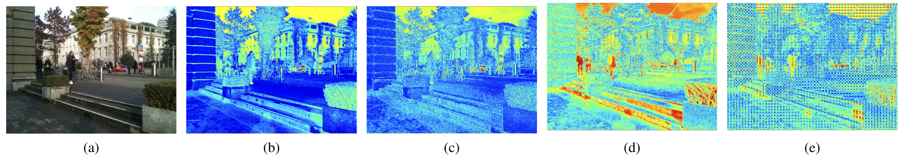

Yukai Shi, Jinghui Qin, Pengxu Wei, **Wanli Ouyang**, Liang Lin, “Perceptual Image Enhancement by Relativistic Discriminant Learning With Cross-Scale Aggregated Representation”, IEEE Access, accepted Mar., 2019.

Zhiwang Zhang, Dong Xu, **Wanli Ouyang**, Chuanqi Tan, “Show, Tell and Summarize: Dense Video Captioning Using Visual Cue Aided Sentence Summarization”, IEEE Trans. Circuits Syst. Video Technol. (CSVT), accepted Aug., 2019.

# Top-Tier Conference Publications

  

    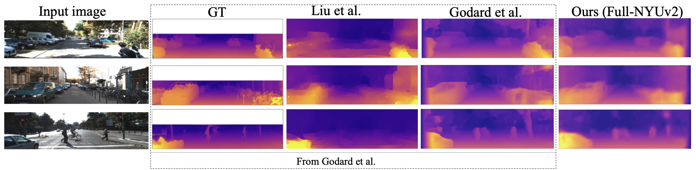
  

  

    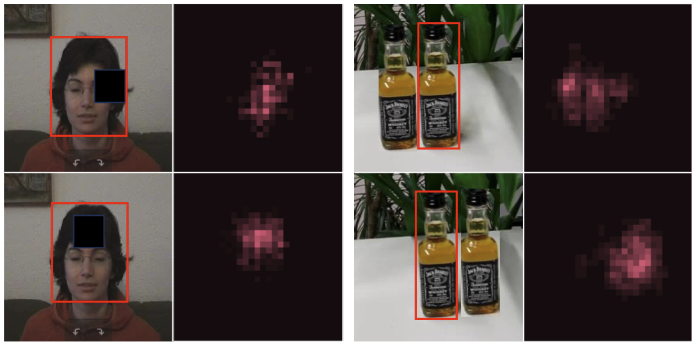
    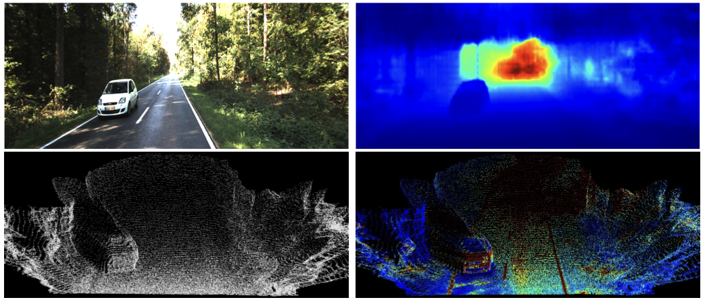
    
  

Peixia Li, Boyu Chen, **W. Ouyang**, Dong Wang, Xiaoyun Yang, Huchuan Lu. ”GradNet: Gradient-Guided Network for Visual Object Tracking”, Proc. ICCV, 2019. (Oral)

Haodong Duan, Kwan-Yee Lin, Sheng Jin, Wentao Liu, Chen Qian, **W. Ouyang**. ”TRB: A Novel Triplet Representation for Understanding 2D Human Body”, Proc. ICCV, 2019. (Oral)

Lingbo Liu, Zhilin Qiu , Guanbin Li, Shufan Liu, **W. Ouyang**, Liang Lin. ”Crowd Counting with Deep Structured Scale Integration Network”, Proc. ICCV, 2019.

Lu Sheng, Dan Xu, **W. Ouyang**, Xiaogang Wang. ”Unsupervised Collaborative Learning of Keyframe Detection and Visual Odometry towards Monocular Deep SLAM”, Proc. ICCV, 2019.

Chen Lin, Minghao Guo, Chuming Li, Xin Yuan, Wei Wu, Junjie Yan, Dahua Lin, **W. Ouyang**. ”Online Hyper-parameter Learning for Auto-Augmentation Strategy”, Proc. ICCV, 2019.

Xinzhu Ma, Zhihui Wang, Haojie Li, Pengbo Zhang, **W. Ouyang**, Xin Fan. ”Accurate Monocular Object Detection via Color-Embedded 3D Reconstruction for Autonomous Driving”, Proc. ICCV, 2019.

Yunan Li, Qiguang Miao, **W. Ouyang**, Zhenxin Ma, Huijuan Fang, Chao Dong, Yining Quan. ”LAP-Net: Level-Aware Progressive Network for Image Dehazing”, Proc. ICCV, 2019.

Chuming Li, Xin Yuan, Chen Lin, Minghao Guo, Wei Wu, Junjie Yan, **W. Ouyang**. ”AM-LFS: AutoML for Loss Function Search”, Proc. ICCV, 2019.

Yingyue Xu, Dan Xu, Xiaopeng Hong, **W. Ouyang**, Rongrong Ji, Min Xu, Guoying Zhao. ”Structured Modeling of Joint Deep Feature and Prediction Refinement for Salient Object Detection”, Proc. ICCV, 2019.

  
  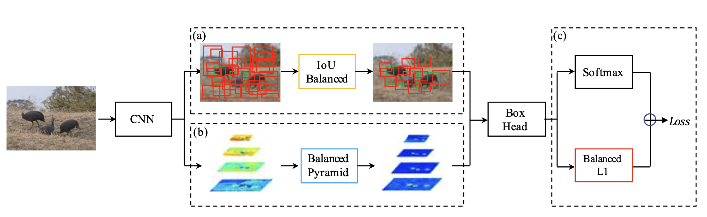

H. Zhang, Jie Cao, Guo Lu, **W. Ouyang**, Zhenan Sun. ”DaNet: Decomposeand-aggregate Network for 3D Human Shape and Pose Estimation ”, Proc. ACM Multimedia, 2019.

Z. Yao, B. Zhang, Z. Wang **W. Ouyang**, D. Xu, D. Feng. ”IntersectGAN: Learning Domain Intersection for Generating Images with Multiple Attributes”, Proc. ACM Multimedia, 2019.

  

    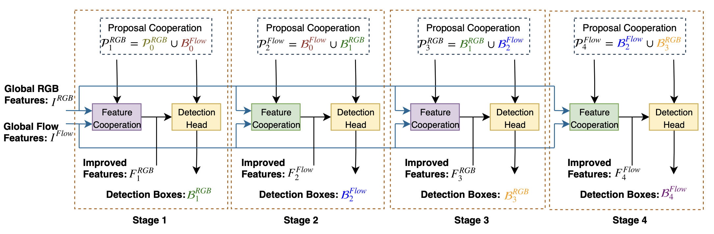
  

  

    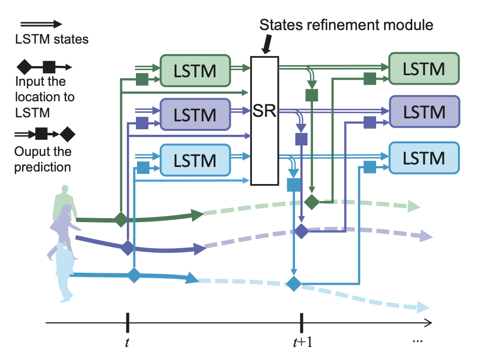
    
  

B. Li, **W. Ouyang**, Lu Sheng, et. al. ”GS3D: An Efficient 3D Object Detection Framework for Autonomous Driving”, Proc. CVPR, 2019.

J. Pang, K. Chen, J. Shi, **W. Ouyang**, et. al. ”Libra R-CNN: Balanced Learning for Object Detection”, Proc. CVPR, 2019.

K. Chen, J. Pang, J. Wang, Y. Xiong, X. Li, S. Sun, W. Feng, Z. Liu, J. Shi, **W. Ouyang**,C. Loy, D. Lin. ”Hybrid Task Cascade for Instance Segmentation”, Proc. CVPR, 2019.

C. Song, Y. Huang, **W. Ouyang**, L. Wang. ”Box-driven Class-wise Region Masking and Filling Rate Guided Loss for Weakly Supervised Semantic Segmentation”, Proc. CVPR, 2019.

S. Jin, W. Liu, **W. Ouyang**, C. Qian. ”Multi-person Articulated Tracking with Spatial and Temporal Embeddings”, Proc. CVPR, 2019.

G. Lu, **W. Ouyang**, D. Xu, C. Cai, X. Zhang, Z. Gao. ”DVC: An End-to-end Deep Video Compression Framework”, Proc. CVPR, 2019. (Oral)

R. Su, **W. Ouyang**,Luping Zhou, Dong Xu. ”Improving Action Localization by Progressive Cross-stream Cooperation”, Proc. CVPR, 2019.

P. Zhang, **W. Ouyang**, Pengfei Zhang, Jianru Xue, Nanning Zheng. ”SRLSTM: State Refinement for LSTM towards Pedestrian Trajectory Prediction”, Proc. CVPR, 2019.

  

Li, Hongyang, Bo Dai, Shaoshuai Shi, **Wanli Ouyang**, and Xiaogang Wang. ”Feature Intertwiner for Object Detection.” ICLR, 2019.

  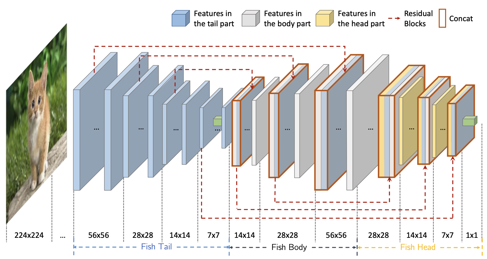

S. Sun, Jiangmiao Pang, Jianping Shi, Shuai Yi, **W. Ouyang**, ”FishNet: A Versatile Backbone for Image, Region, and Pixel Level Prediction”, Proc. NIPS, 2018.

  

    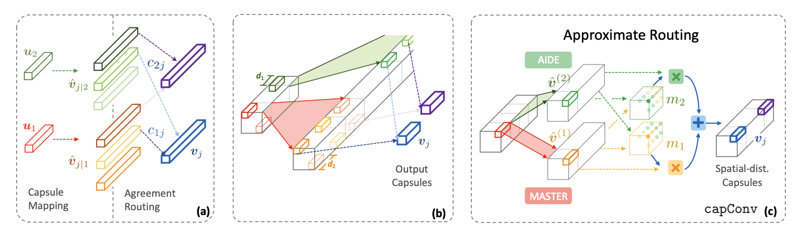
  

  

    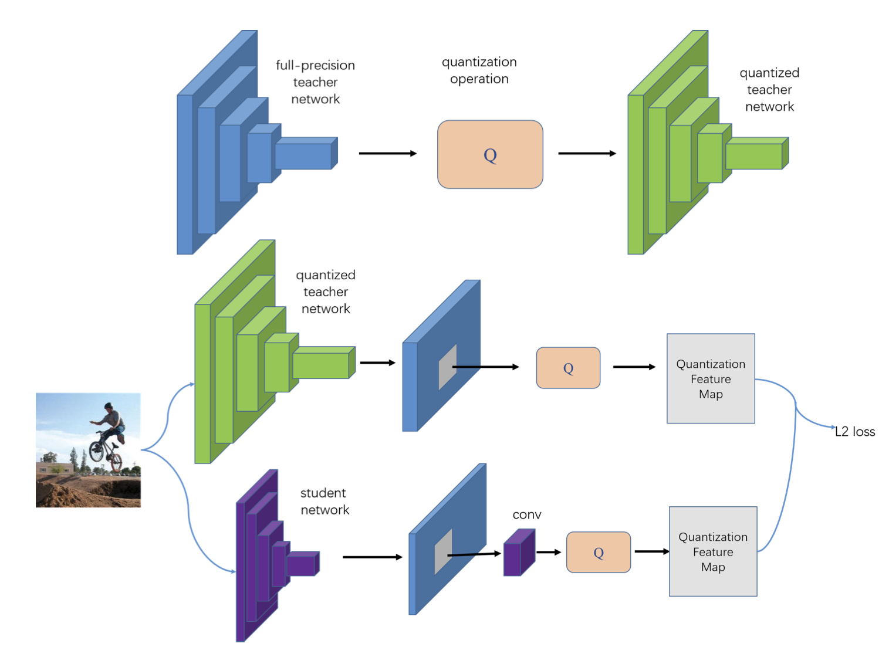
    
  

Y. Wei, X. Pan, H. Qin, J. Yan, **W. Ouyang**, ”Quantization Mimic: Towards Very Tiny CNN for Object Detection”, Proc. ECCV, 2018.

G. Lu, **W. Ouyang**, D. Xu, X. Zhang, Z. Gao, M.-T. Sun, ”Deep Kalman Filtering Network for Video Compression Artifact Reduction”, Proc. ECCV, 2018.

D. Chen, S. Zhang, **W. Ouyang**, J. Yang, Y. Tai, ”Person Search via A Maskguided Two-stream CNN Model”, Proc. ECCV, 2018.

D. Wang, **W. Ouyang**, W. Li, D. Xu, ”Dividing and Aggregating Network for Multi-view Action Recognition”, Proc. ECCV, 2018.

Y. Li, **W. Ouyang**, B. Zhou, Y. Cui, J. Shi, C. Zhang, X. Wang, ”Factorizable Net: An Efficient Subgraph-based Framework for Scene Graph Generation”, Proc. ECCV, 2018.

H. Li, B. Dai, **W. Ouyang**, X. Guo, X. Wang, ”Neural Network Encapsulation ”, Proc. ECCV, 2018.

  

    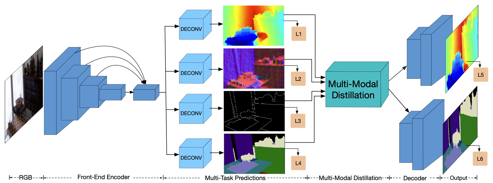
  

  

    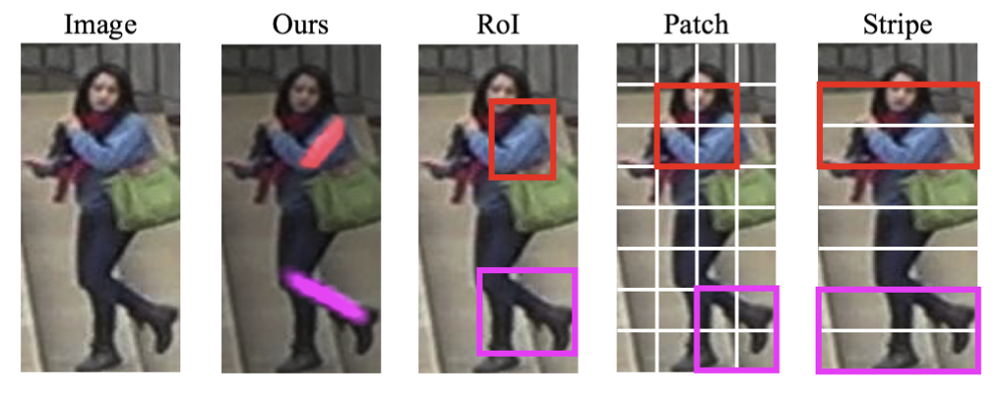
    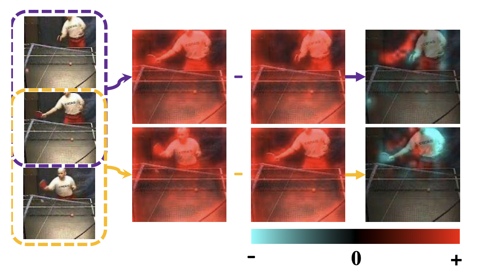
    
  

X. Dong, Y. Yan, **W. Ouyang**, Yi Yang. ”Style Aggregated Network for Facial Landmark Detection”, Proc. CVPR, 2018.

Y. Li, N. Duan, B. Zhou, X. Chu, **W. Ouyang**, X. Wang. ”Visual Question Generation as Dual Task of Visual Question Answering”, Proc. CVPR, 2018.

J. Xu, R. Zhao, F. Zhu, H. Wang, **W. Ouyang**. ”Attention-aware Compositional Network for Person Re-Identification”, Proc. CVPR, 2018.

Y. Wu, Y. Lin, X. Dong, Y. Yan, **W. Ouyang**, Yi Yang. ”Exploit the Unknown Gradually: One-Shot Video-Based Person Re-Identification by Stepwise Learning”, Proc. CVPR, 2018.
W. Yang, **W. Ouyang**, X. Wang, X. Wang. ”3D Human Pose Estimation in the Wild by Adversarial Learning”, Proc. CVPR, 2018.

W. Zhang, **W. Ouyang**, D. Xu, W. Li. ”Collaborative and Adversarial Network for Unsupervised domain adaptation”, Proc. CVPR, 2018.

S. Sun, Z. Kuang, L. Sheng, **W. Ouyang**, W. Zhang. ”Optical Flow Guided Feature: A Motion Representation for Video Action Recognition”, Proc. CVPR, 2018.

D. Xu, **W. Ouyang**, X. Wang, N. Sebe. ”PAD-Net: Multi-Tasks Guided Prediciton-and-Distillation Network for Simultaneous Depth Estimation and Scene Parsing ”, Proc. CVPR, 2018.

C. Song, Y. Huang, **W. Ouyang**, L. Wang. ”Mask-guided Contrastive Attention Model for Person Re-Identification ”, Proc. CVPR, 2018.

  

L. Liu, H. Wang, G. Li, **W. Ouyang**, L. Lin, ”Crowd Counting using Deep Recurrent Spatial-Aware Network”, Proc. IJCAI, 2018.

  

    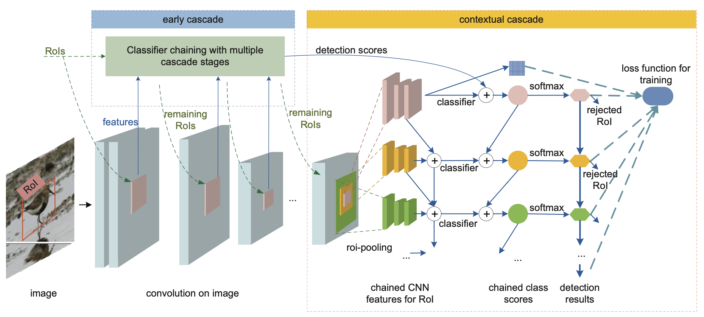
  

  

    
    
  

**W. Ouyang**, Kun Wang, Xin Zhu, Xiaogang Wang. ”Chained Cascade Network for Object Detection”, Proc. ICCV, 2017.

Wei Yang, Shuang Li, **W. Ouyang**, Hongsheng Li, Xiaogang Wang. ”Learning Feature Pyramids for Human Pose Estimation”, Proc. ICCV, 2017.

Yikang Li, **W. Ouyang**, Bolei Zhou, Kun Wang, Xiaogang Wang. ”Scene Graph Generation from Objects, Phrases and Region Captions”, Proc. ICCV, 2017.

Qi Chu, **W. Ouyang**, Hongsheng Li, Xiaogang Wang, Bin Liu, Nenghai Yu. ”Online Multi-Object Tracking Using CNN-based Single Object Tracker with SpatialTemporal Attention Mechanism”, Proc. ICCV, 2017.

  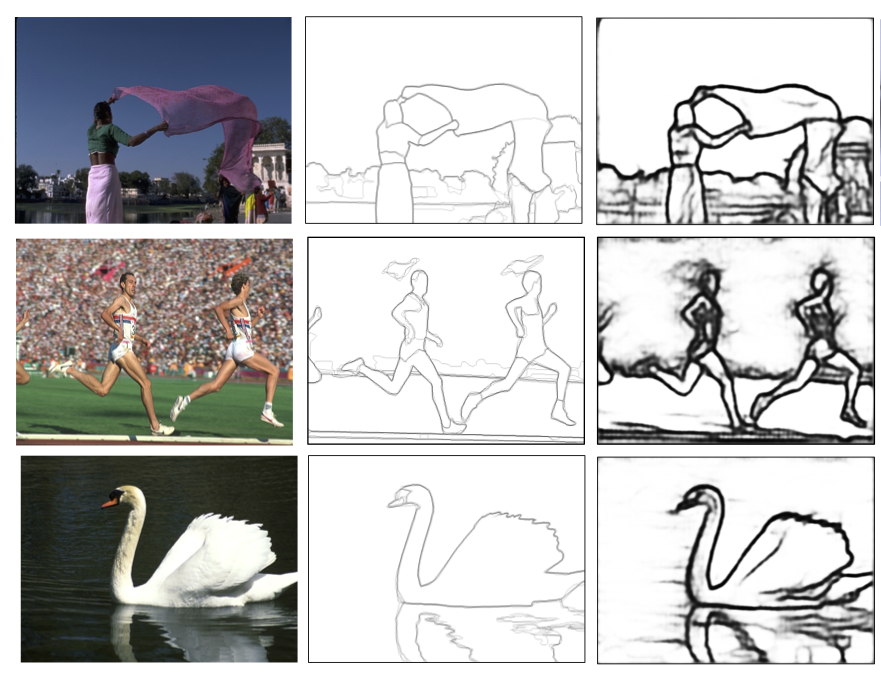

Dan Xu, **W. Ouyang**, Xavier Alameda-Pineda, Elisa Ricci, Xiaogang Wang, Nicu Sebe. ”Learning Deep Structured Multi-Scale Features using Attention-Gated CRFs for Contour Prediction”, Proc. NIPS, 2017.

  

    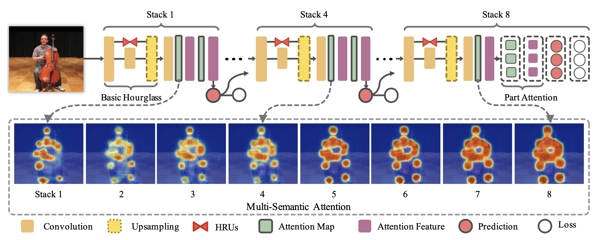
  

  

    
    
  

Kai Kang, Hongsheng Li, **W. Ouyang** , Junjie Yan, Xihui Liu, Tong Xiao, Xiaogang Wang. ”Object Detection in Vidoes with Tubelet Proposal Networks”, Proc. CVPR , 2017.

Feng Zhu, Hongsheng Li, **W. Ouyang** , Nenghai Yu, Xiaogang Wang. ”Learning Spatial Regularization with Image-level Supervisions for Multi-label Image Classification”, Proc. CVPR, 2017.

Yu Liu, Junjie Yan, **W. Ouyang**. ”Quality Aware Network for Set to Set Recognition”, Proc. CVPR , 2017.

Yikang Li , **W. Ouyang** , Xiaogang Wang. ”ViP-CNN: A Visual Phrase Reasoning Convolutional Neural Network for Visual Relationship Detection”, Proc. CVPR, 2017.

Xiao Chu, Wei Yang, **W. Ouyang** , Xiaogang Wang, Alan Yuille. ”MultiContext Attention for Human Pose Estimation”, Proc. CVPR , 2017.

Dan Xu, Elisa Ricci, **W. Ouyang**, Xiaogang Wang, Nicu Sebe. Multi-Scale Continuous CRFs as Sequential Deep Networks for Monocular Depth Estimation”, Proc. CVPR , 2017.

Dan Xu, **W. Ouyang** , Elisa Ricci, Xiaogang Wang, Nicu Sebe. “Learning CrossModal Deep Representations for Robust Pedestrian Detection”, Proc. CVPR , 2017.

  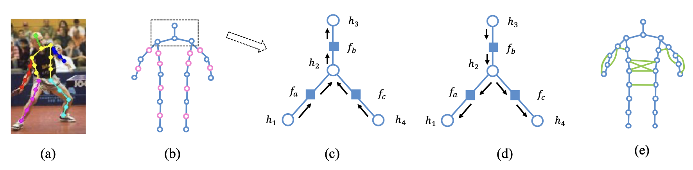

X. Chu, **W. Ouyang**, H. Li, X. Wang. ”CRF-CNN: Modeling Structured Information in Human Pose Estimation”, Advances In Neural Information Processing Systems (NIPS), 2016.

  
  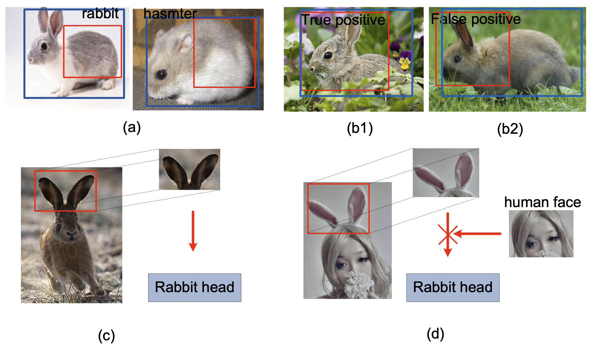

Z. Wang, H. Li, **W. Ouyang**, X. Wang. ”Learnable Histogram: Statistical Context Features for Deep Neural Networks”, in Proc. ECCV, 2016.

Xingyu Zeng, **W. Ouyang**, Bin Yang, Junjie Yan, Xiaogang. ”Gated Bidirectional CNN for Object Detection”, in Proc. ECCV, 2016.

  

Hongyang Li, **W. Ouyang**, Xiaogang Wang ”Multiple Bias on Non-linearity Activation in Deep Neural Networks”, In Proc. ICML 2016.

  

    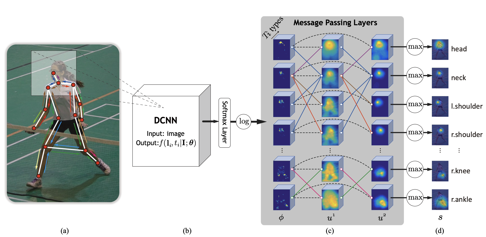
  

  

    
    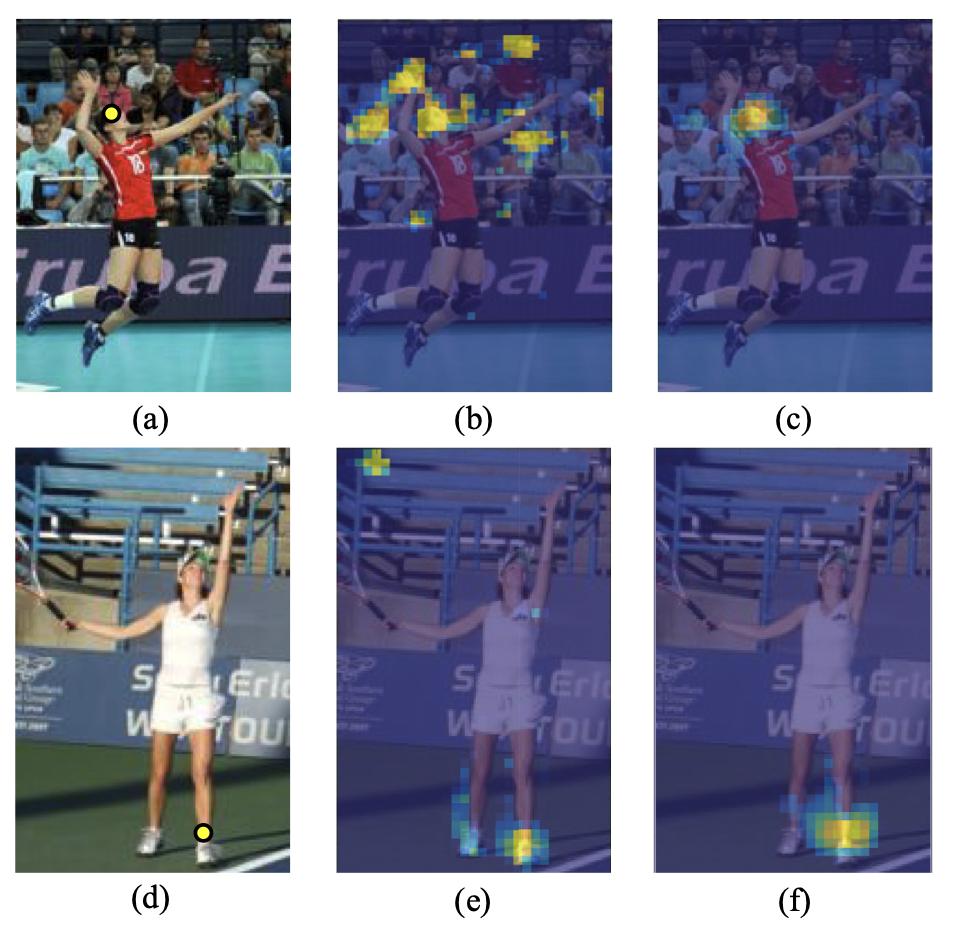
  

**W. Ouyang**, X. Wang, C. Zhang, and X. Yang. ”Factors in finetuning deep model for object detection with long-tail distribution”. In Proc. CVPR, 2016.

T. Xiao, H. Li, **W. Ouyang**, and X. Wang. ”Learning Deep Feature Representations with Domain Guided Dropout”. In Proc. CVPR, 2016.

K. Kang, **W. Ouyang**, H. Li, X. Wang. ”Object Detection from Video Tubelets with Convolutional Neural Networks ”. In Proc. CVPR, 2016.

W. Yang, **W. Ouyang**, H. Li, X. Wang. ”End-to-End Learning of Deformable Mixture of Parts and Deep Convolutional Neural Networks for Human Pose Estimation”. In Proc. CVPR, 2016 (Oral).

X. Chu, **W. Ouyang**, H. Li, and X. Wang. ”Structured feature learning for pose estimation”. In Proc. CVPR, 2016.

L. Wang, **W. Ouyang**, X. Wang, and H. Lu. ”STCT: Sequentially training convolutional networks for visual tracking”. In Proc. CVPR, 2016.

  
  
  

**W. Ouyang**, Hongyang Li, Xingyu Zeng, Xiaogang Wang, ”Learning Deep Representation with Large-scale Attributes”, In Proc. ICCV, 2015.

Xiao Chu, Wei Yang, **W. Ouyang**, Xiao gang Wang, ”Multi-task Recurrent Neural Network for Immediacy Prediction”, In ICCV, 2015 (Oral).

Lijun Wang, **W. Ouyang**, Xiaogang Wang, Huchuan Lu, ”Visual Tracking with Fully Convolutional Networks”, In Proc. ICCV, 2015.

  
  

**W. Ouyang**, Xiaogang Wang, Xingyu Zeng, Shi Qiu, Ping Luo, Yonglong Tian, Hongsheng Li, Shuo Yang, Zhe Wang, Chen-Change Loy and Xiaoou Tang, ”DeepIDNet: Deformable Deep Convolutional Neural Networks for Object Detection”, In Proc. CVPR, 2015.

Rui Zhao, **W. Ouyang**, Hongsheng Li, and Xiaogang Wang, ”Saliency Detection by Multi-context Deep Learning”, In Proc. CVPR, 2015.

  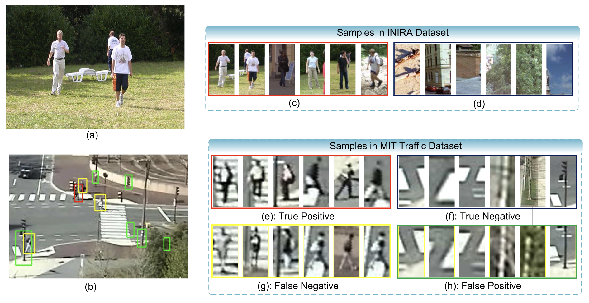
  

Xingyu Zeng, **W. Ouyang**, and X. Wang, ”Deep Learning of Scene-speffic Classiffier for Pedestrian Detection,” In Proc. ECCV, Sept. 2014.

  
  

Zhao, Rui, **W. Ouyang**, and Xiaogang Wang. ”Learning mid-level filters for person re-identification.” In Proc. CVPR, Columbus, USA, Jun. 2014.

**W. Ouyang**, X. Chu, and X. Wang, ”Multi-source Deep Learning for Human Pose Estimation,” In Proc. CVPR, Columbus, USA, Jun. 2014.

  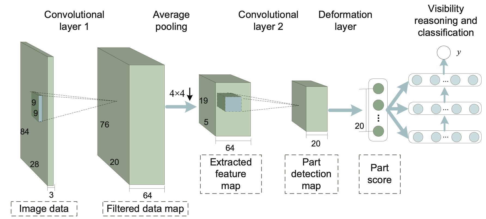
  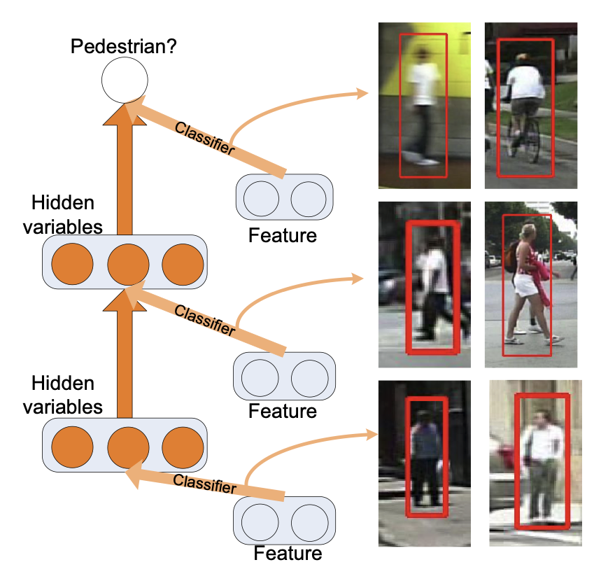
  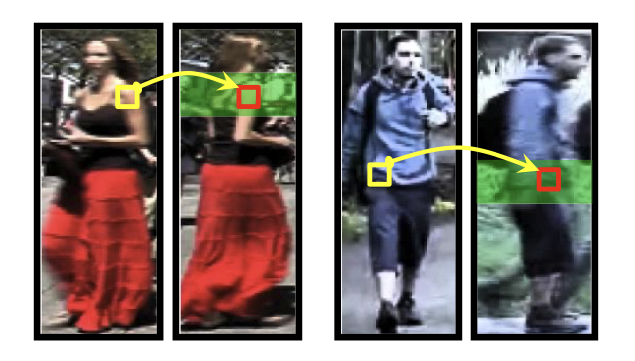

**W. Ouyang**, and X. Wang, ”Joint Deep Learning for Pedestrian Detection,” In Proc. ICCV, Sydney, Australia, Dec. 2013.

X. Zeng, **W. Ouyang**, and X. Wang, ”Multi-Stage Contextual Deep Learning for Pedestrian Detection,” In Proc. ICCV, Sydney, Australia, Dec. 2013.

Rui Zhao, **W. Ouyang**, and X. Wang, ”Person Re-identification by Salience Matching,” In Proc. ICCV, Sydney, Australia, Dec. 2013.

  
  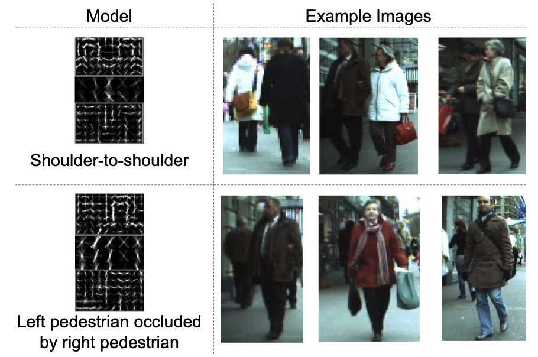
  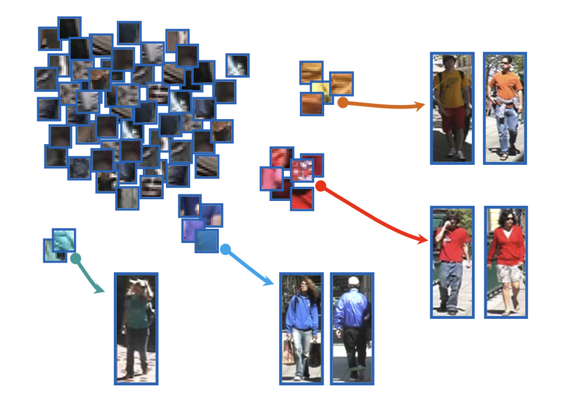

**W. Ouyang**, X. Zeng, and X. Wang, ”Modeling Mutual Visibility Relationship in Pedestrian Detection,” In Proc. CVPR, Portland, USA, Jun. 2013.

**W. Ouyang**, and X. Wang, ”Single-Pedestrian Detection aided by Multipedestrian Detection,” In Proc. CVPR, Portland, USA, Jun. 2013.

Rui Zhao, **W. Ouyang**, and X. Wang, ”Unsupervised Salience Learning for Person Re-identification,” In Proc. CVPR, Portland, USA, Jun. 2013.

**W. Ouyang**, and X. Wang, ”A Discriminative Deep Model for Pedestrian Detection with Occlusion Handling,” In Proc. CVPR, Rhode Island, USA, Jun. 2012.

  

**W. Ouyang**, R. Zhang and W.-K. Cham, “Fast pattern matching using orthogonal Haar transform ”. In Proc. CVPR, San Francisco, USA, Jun. 2010.

[1]:	/publication/
[2]:	/publication/