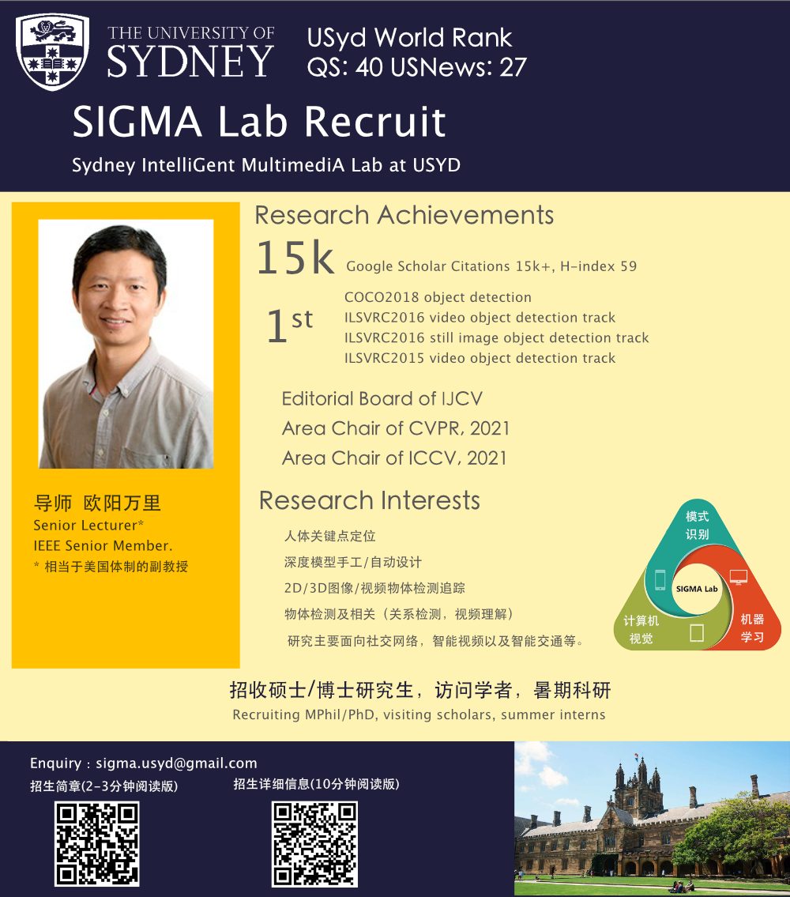

We are always recruiting **M.Phil. or Ph.D.** students with strong academic background and solid programming skill. Before you apply, please first read the [**Application Guideline for SIGMA Lab**](/guidelines/guideline_eng.pdf). For Chinese students, please refer to [**SIGMA Lab招生简章**](/guidelines/ad.pdf) and [**SIGMA Lab申请须知**](/guidelines/guideline_chinese.pdf) and [**关于悉尼大学奖学金申请**](/guidelines/scholarship_chi.pdf). You can send an email to [**sigma.usyd[at]gmail.com**](mailto:sigma.usyd@gmail.com) after you have read the guidelines carefully. 

Note that your email title should be formatted as "Affiliation_Name_Program". For example, if your name is Kevin and you are a student from the University of Sydney who intends to apply for the Ph.D. program, then your email title should be "USYD_Kevin_Ph.D.".

Currently, **we have no position for  postdoc researchers  and  research assistants  for our lab**.
